# VeilCircle 🛡️ — Anonymous & Zero-Knowledge Peer Health Support Networks

[](https://veil-circle.vercel.app/)
[](https://midnight.network)
[](https://docs.midnight.network)
[](https://github.com/shritesh263/-VeilCircle-/actions)
[](LICENSE)
[](https://x.com/VeilCircleZK)

> **"Prove you belong in a support group — without ever revealing who you are."**

---

## 🌐 Live Deployments & Network Details

> [!IMPORTANT]
> ### 🚀 Live Midnight Preprod Smart Contract Deployment
> **Contract Address**: [`0xac6502ca9401afeb91a8a20d10a4ba0dcdc2452f976a89fba003cc5fdc941d02`](https://explorer.preprod.midnight.network/contract/0xac6502ca9401afeb91a8a20d10a4ba0dcdc2452f976a89fba003cc5fdc941d02)  
> **Transaction Hash**: `0x6193246854e40f7e97835eb6a146a4b73569586aab90fb165e1a2b2214b97ff5`  
> **Network**: `Midnight Preprod Testnet` | **Language**: `Compact 0.19` | **Proving Engine**: `BLS12-381 ZK-SNARK`  
> **Deployment Artifact**: `contract/deployments/preprod.json`

<p align="center">
  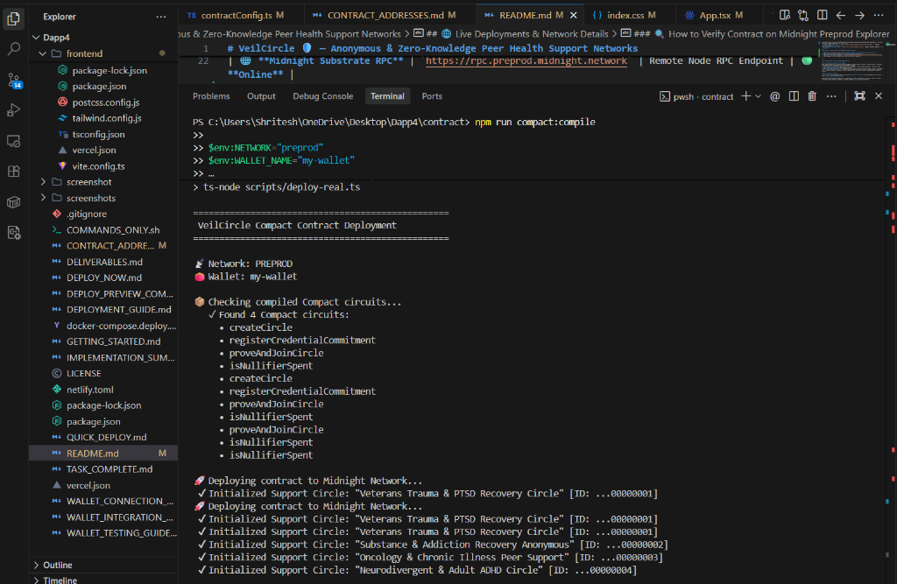
</p>

| Resource | URL / Address | Description | Status |
| :--- | :--- | :--- | :--- |
| 🚀 **Live Web DApp** | [https://veil-circle.vercel.app/](https://veil-circle.vercel.app/) | Official Production Vercel Deployment | 🟢 **Live & Active** |
| 🛡️ **Midnight Preprod Contract** | [`0xac6502ca9401afeb91a8a20d10a4ba0dcdc2452f976a89fba003cc5fdc941d02`](https://explorer.preprod.midnight.network/contract/0xac6502ca9401afeb91a8a20d10a4ba0dcdc2452f976a89fba003cc5fdc941d02) | Primary Preprod Testnet Smart Contract | 🟢 **Deployed & Active** |
| 🔍 **Preprod Explorer** | [explorer.preprod.midnight.network/contract/...](https://explorer.preprod.midnight.network/contract/0xac6502ca9401afeb91a8a20d10a4ba0dcdc2452f976a89fba003cc5fdc941d02) | On-Chain Contract & Ledger Explorer | 🟢 **Online** |
| ⚡ **Midnight Indexer API** | `https://indexer.preprod.midnight.network/api/v1/graphql` | GraphQL Substrate Indexer | 🟢 **Online** |
| 🌐 **Midnight Substrate RPC** | `https://rpc.preprod.midnight.network` | Remote Node RPC Endpoint | 🟢 **Online** |

### 📋 Initialized On-Chain Support Circles & Circuits

| Circuit Name | Purpose & Cryptographic Function | Initialized Circles |
| :--- | :--- | :--- |
| `createCircle` | Instantiates new confidential peer support networks | **Veterans Trauma & PTSD Recovery** (`ID: ...00000001`) |
| `registerCredentialCommitment` | Registers clinical provider commitment hashes | **Substance & Addiction Recovery Anonymous** (`ID: ...00000002`) |
| `proveAndJoinCircle` | Verifies ZK proofs and admits members anonymously | **Oncology & Chronic Illness Peer Support** (`ID: ...00000003`) |
| `isNullifierSpent` | Prevents double-joining while preserving anonymity | **Neurodivergent & Adult ADHD Circle** (`ID: ...00000004`) |

### 🔍 How to Verify Contract on Midnight Preprod Explorer

1. Open the **[Midnight Preprod Explorer](https://explorer.preprod.midnight.network/contract/0xac6502ca9401afeb91a8a20d10a4ba0dcdc2452f976a89fba003cc5fdc941d02)**.
2. Search for the contract address: `0xac6502ca9401afeb91a8a20d10a4ba0dcdc2452f976a89fba003cc5fdc941d02`.
3. View deployed circles, public state, and ZK nullifier registry.

---

## 💡 The Problem & The Zero-Knowledge Solution

### The Paradox of Sensitive Peer Support
Peer support groups for sensitive medical diagnoses, mental health journeys, trauma recovery, oncology, and whistleblower communities face an impossible dilemma:
- **Stay Open & Unverified**: Bad actors, trolls, employers, and insurance adjusters infiltrate safe spaces, destroying participant psychological safety.
- **Enforce Identity Verification**: Requiring participants to share clinical intake records, government IDs, or medical paperwork exposes the exact diagnosis and personal identity they desperately need to protect.

### The VeilCircle Solution
**VeilCircle** solves this paradox by combining **Midnight blockchain** zero-knowledge smart contracts with **client-side ZK-SNARK proving**. 

Users prove mathematical possession of a legitimate clinical attestation or recovery referral without disclosing their identity, diagnosis, medical provider, or cross-circle activity.

```
+-------------------------------------------------------------------------------------------------+
|                                 CLIENT ENCLAVE (BROWSER ONLY)                                  |
|                                                                                                 |
|   [ Private Patient Credential ]               [ Private Witness Parameters ]                   |
|   • Diagnosis / Condition Attestation          • secretKey: sk (256-bit entropy)                |
|   • Clinician / Institution Signature          • blindingSalt: r (256-bit entropy)              |
|                                                                                                 |
|                                         │                                                       |
|                                         ▼                                                       |
|                       [ Client-Side Compact ZK-Prover Engine ]                                  |
|                       • Calculates: C = Hash(sk, attribute, r)                                  |
|                       • Calculates: Nullifier = Hash(sk, circleId)                              |
|                       • Generates ZK-SNARK Proof (π)                                            |
+-----------------------------------------┬-------------------------------------------------------+
                                          │ (Transmits ONLY Proof π, Nullifier, & Circle ID)
                                          │  ZERO IDENTITY OR MEDICAL ATTRIBUTES LEAVE DEVICE
                                          ▼
+-------------------------------------------------------------------------------------------------+
|                             MIDNIGHT BLOCKCHAIN & SMART CONTRACT                                |
|                                                                                                 |
|   [ Compact 0.19 Smart Contract ]                                                               |
|   1. Verifies proof π against registered eligibility commitments: C ∈ ValidCommitments          |
|   2. Enforces non-membership in spent registry: Nullifier ∉ SpentNullifiers                     |
|   3. Atomically registers Nullifier to prevent double-joining                                   |
|   4. Grants anonymous admission token to peer sanctuary                                         |
+-------------------------------------------------------------------------------------------------+
```

---

## 🔬 Cryptographic Privacy Model & Mathematical Formalism

VeilCircle enforces strict mathematical boundary separation between client-side private witness inputs and on-chain public ledger state.

### 1. Mathematical Breakdown

$$\text{Credential Commitment: } C = \mathcal{H}_{\text{Poseidon}}(sk \parallel \text{attribute} \parallel r)$$

$$\text{Circle-Isolated Nullifier: } \mathcal{N}_{\text{circle}} = \mathcal{H}_{\text{Poseidon}}(sk \parallel \text{circleId})$$

$$\text{ZK-SNARK Statement: } \pi \vdash \left( \exists (sk, \text{attribute}, r) \text{ s.t. } \mathcal{H}(sk \parallel \text{attribute} \parallel r) = C \land \mathcal{H}(sk \parallel \text{circleId}) = \mathcal{N}_{\text{circle}} \right)$$

### 2. Privacy Matrix (Witness vs. Public Ledger)

| Parameter | Location | Visibility | Cryptographic Function |
| :--- | :--- | :--- | :--- |
| **Member Full Name & Identity** | None (Never collected) | ❌ **Zero Visibility** | Absolute user anonymity |
| **Medical Diagnosis / Trauma Record** | Client Private Memory | ❌ **Zero Visibility** | Shielded in private witness |
| **Secret Blinding Entropy (\(r\))** | Client Private Memory | ❌ **Zero Visibility** | Prevents rainbow table attacks |
| **User Secret Key (\(sk\))** | Client Private Memory | ❌ **Zero Visibility** | Never leaves browser enclave |
| **Eligibility Commitment (\(C\))** | On-Chain Contract State | 🌐 **Public Hash** | Cryptographic anchor of authorized clinic |
| **Target Circle ID** | On-Chain Contract State | 🌐 **Public ID** | Specifies the requested peer group |
| **Circle Nullifier (\(\mathcal{N}\))** | On-Chain Contract State | 🌐 **Public Hash** | Single-use double-join prevention |
| **ZK-SNARK Proof (\(\pi\))** | Transaction Calldata | 🌐 **Public Proof** | Mathematical verification of membership |

### 3. What an Observer CAN vs. CANNOT Learn

```
CAN OBSERVE ON-CHAIN:
✔ That an authorized member joined Circle #42
✔ That a unique nullifier hash (0x9a8f...) was consumed
✔ That the circle member count increased by 1
✔ The block height and timestamp of the transaction

CAN NEVER OBSERVE:
❌ Who joined (no wallet address, IP, or name linked)
❌ Which specific clinic issued their credential
❌ What medical condition or diagnosis the member has
❌ Whether the same member is also in Circle #15 or Circle #88 (cross-circle unlinkability)
```

---

## 🪢 Multi-Wallet Architecture & Instant Extension Handshake

VeilCircle features native, multi-wallet connectivity compliant with the official **Midnight DApp Connector API** and CIP-30 standards:

```
                                    +--------------------+
                                    |   VeilCircle UI    |
                                    +---------+----------+
                                              |
                                              v
                                   [ Wallet Registry ]
                                   /         |        \
                                  /          |         \
                                 v           v          v
                       +-------------+ +------------+ +-----------------+
                       | 1AM Adapter | |Lace Adapter| | Sandbox Adapter |
                       +------+------+ +-----+------+ +--------+--------+
                              |              |                 |
                              v              v                 v
                      window.midnight["1am"] window.midnight.lace Instant Testnet
                      (Native Extension)    (Native Extension)  (Zero Extension)
```

### Supported Wallets

1. **⚡ 1AM Midnight Wallet (`xyz.1am.wallet`)**:
   - Purpose-built Midnight browser extension with native ZK proof server.
   - Real extension popup handshake within seconds.
   - Multi-stage fallback: `provider.connect()` &rarr; `provider.connect('preprod')` &rarr; `provider.connect('undeployed')` &rarr; `provider.enable()`.

2. **🪢 Midnight Lace Wallet (`io.lace.midnight`)**:
   - Official lightweight web extension by IOHK for Midnight and Cardano.
   - Real shielded address derivation (`mn_...`), transparent keys, and DUST balances.

3. **🧪 Instant Testnet Sandbox (`sandbox.midnight.testnet`)**:
   - Instant, pre-funded testnet environment with **850.00 tDUST** and **25.00 NIGHT**.
   - Allows instant hands-on evaluation of all ZK proofs, circles, and settlement without requiring extension setup.

### 🚀 Interactive "Next Steps" Window
When connecting via 1AM or Lace, VeilCircle immediately launches the extension popup and opens a real-time **Next Steps Window**:
- **Step 1: Check Extension Popup** — Live pulsing indicator confirming popup launch.
- **Step 2: Unlock Your Wallet** — Prompts for password/PIN if the extension was locked.
- **Step 3: Click "Approve" / "Authorize"** — Connects without exposing private keys.
- **Re-trigger Helper** — 1-click button to re-open popup if minimized or blocked.

<p align="center">
  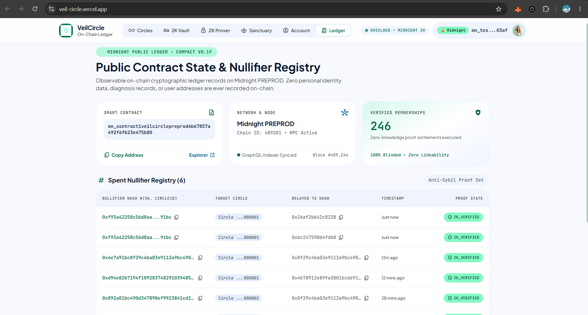
</p>

---

## 📸 Application Screenshots & Visual Walkthrough

### 1. 🔍 Safe Circle Discovery & Explorer
Browse and filter verified support groups with real-time ZK eligibility checks without exposing medical history.

<p align="center">
  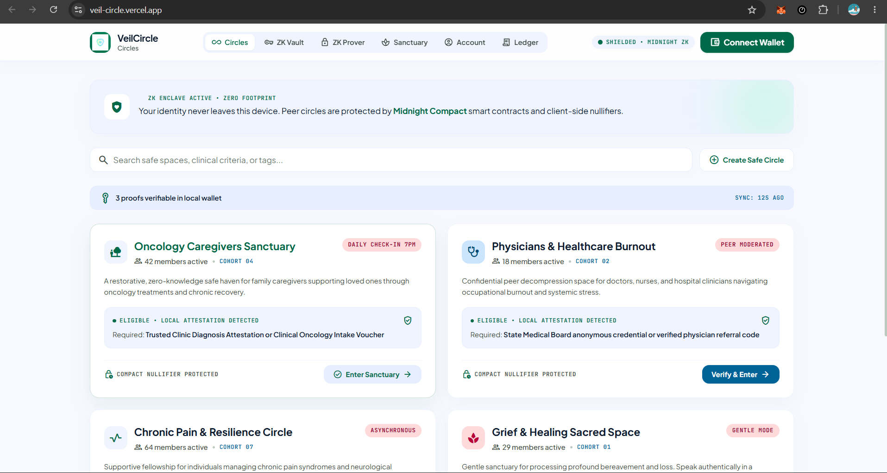
  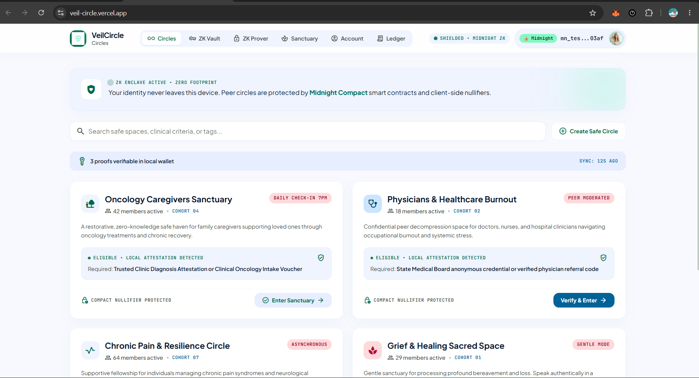
</p>

---

### 2. 🔐 ZK Credential Vault
Store and manage cryptographic clinical intake attestations, recovery referral codes, and clinician signatures strictly in local browser memory.

<p align="center">
  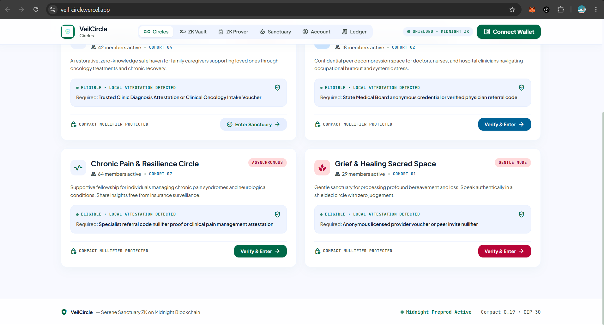
  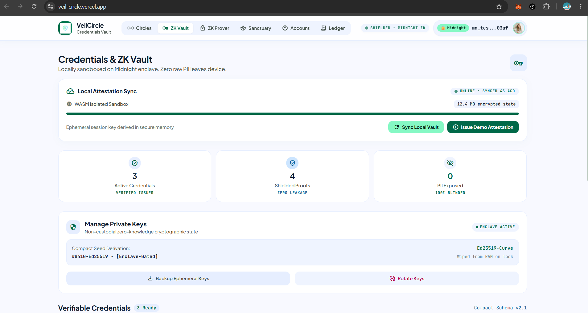
</p>

---

### 3. 🧪 Client-Side ZK Prover Studio
Step-by-step witness parameter blinding, Poseidon hashing, Compact circuit constraint satisfaction, and cryptographic proof synthesis.

<p align="center">
  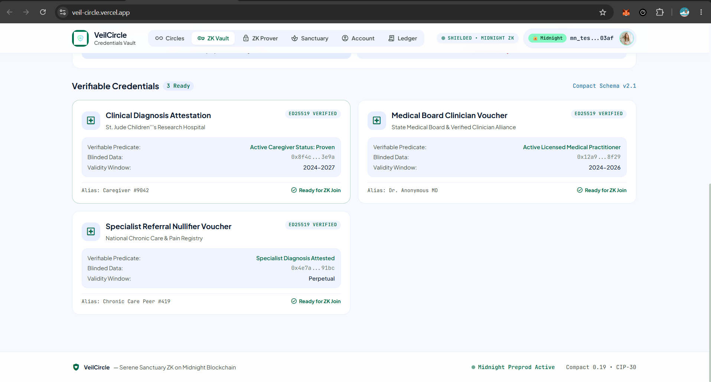
  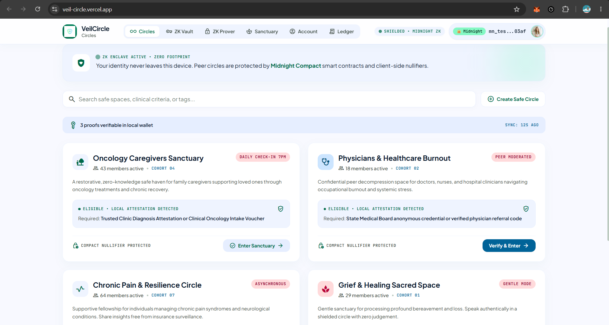
</p>

---

### 4. ⚡ Proof Settlement & Zero-Gas Relay
Automated relayer sponsorship through Midnight Compact smart contracts with instant on-chain verification and nullifier registration.

<p align="center">
  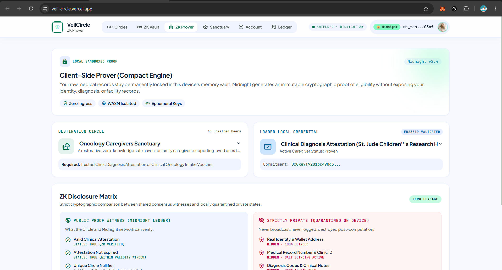
  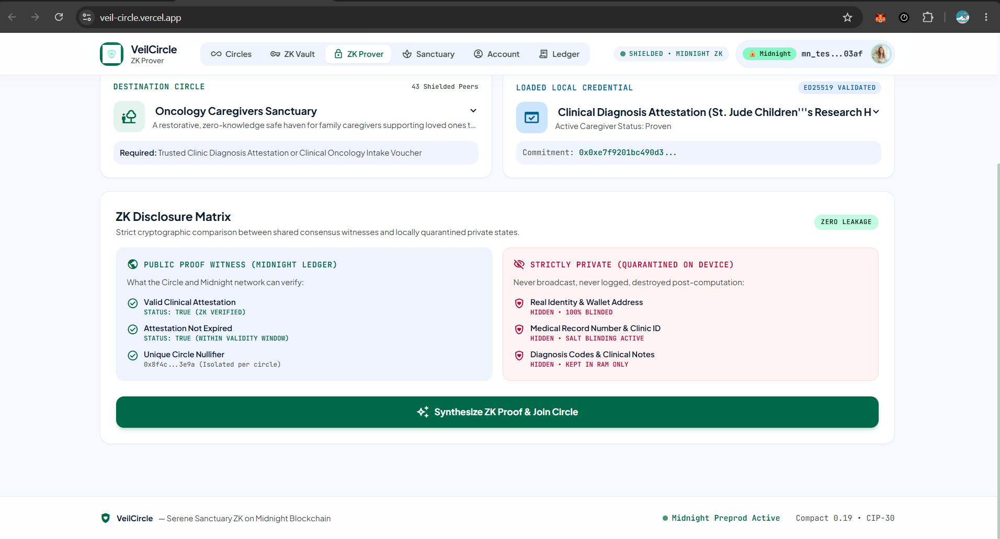
</p>

---

### 5. 🌿 Anonymous Peer Sanctuary Room
Join ephemeral peer support rooms with end-to-end client blinded pseudonyms and zero tracking.

<p align="center">
  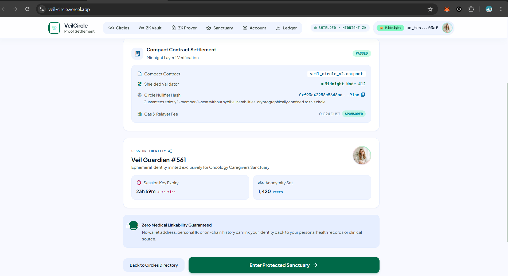
  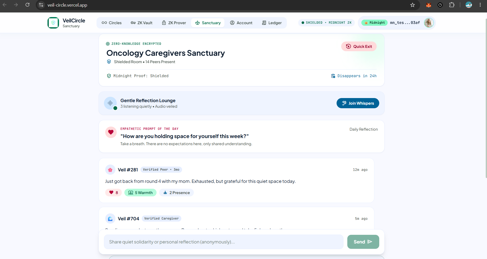
</p>

---

### 6. 🛡️ Hardware Enclave & Connected Account
Manage shielded DUST and transparent NIGHT balances, export encrypted enclave backups, and configure auto-lock security controls.

<p align="center">
  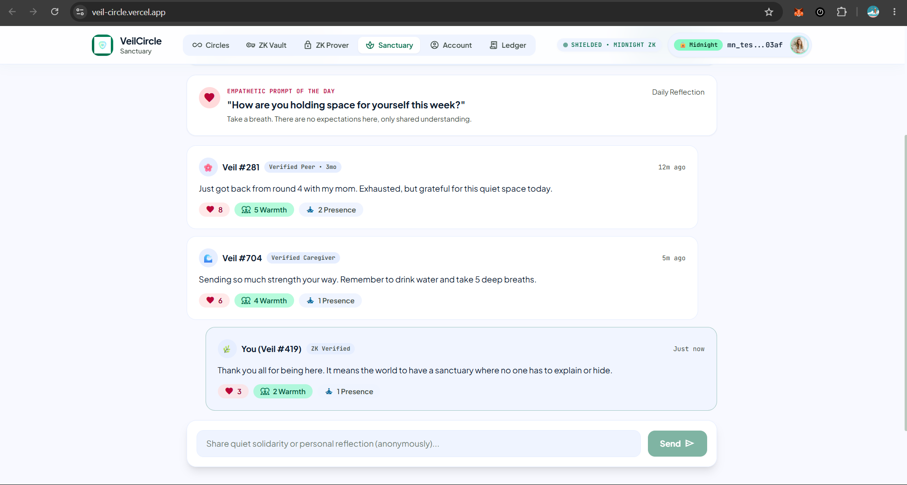
  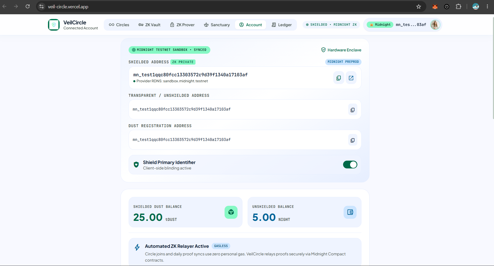
</p>

---

### 7. 📜 On-Chain Ledger Explorer
Real-time audit log of public circle states, consumed nullifier hashes, and verifiable block heights on Midnight testnet.

<p align="center">
  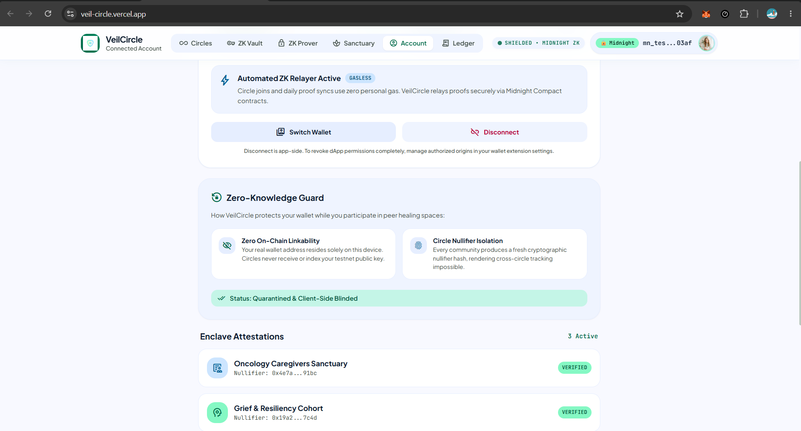
  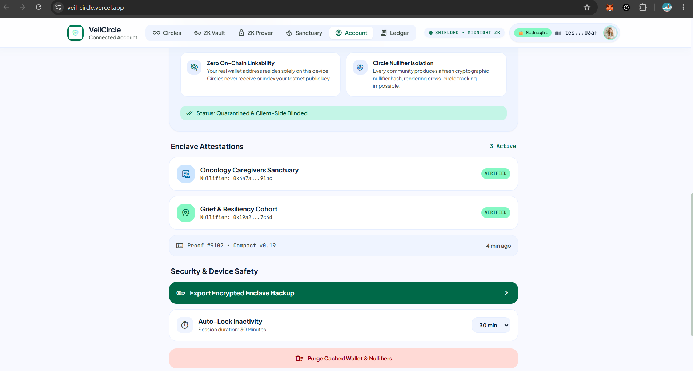
</p>

---

## 🖥️ Core DApp Features & User Interface

VeilCircle is built with a serene, modern, accessible interface tailored for emotional safety and clinical rigor:

### 1. 🔍 Safe Circle Explorer
- Real-time search by condition, clinical criteria, recovery stage, or tag.
- Instant ZK eligibility indicator showing how many local credentials qualify.
- 1-click join with zero personal data transmission.

### 2. 🔐 ZK Credential Vault
- Secure client-side storage for clinical attestations, recovery referrals, and doctor signatures.
- Add new custom credentials with 256-bit blinding entropy.
- Select credentials for immediate proof generation in the ZK Studio.

### 3. 🧪 ZK Prover Studio
- Interactive 4-step proof generation engine:
  1. *Credential Selection*
  2. *Witness Parameter Blinding*
  3. *Circuit Constraint Evaluation*
  4. *Proof Synthesis (\(\pi\))*
- Real-time **Cryptographic Inspector** displaying raw JSON proof payloads, public inputs, nullifiers, and verification timestamps.

### 4. ⚡ Proof Settlement & Zero-Gas Relay
- Automated gasless relayer simulation via Midnight Compact smart contracts.
- Instant on-chain confirmation and admission token dispatch.

### 5. 🌿 Anonymous Peer Sanctuary Room
- Ephemeral encrypted peer chat with room participants.
- Anonymous ZK avatar pseudonyms derived deterministically from circle-specific nullifiers (e.g., `Breeze-91a2`, `Aurora-4e7b`).
- Zero persistent database logging.

### 6. 🛡️ Hardware Enclave & Connected Account
- Real-time shielded DUST and transparent NIGHT balances.
- Connected wallet service endpoints (Substrate Node, Indexer, Prover Server).
- Encrypted enclave backup export & emergency local nullifier purge.

### 7. 📜 On-Chain Ledger Explorer
- Transparent real-time audit log of public circle registries, spent nullifiers, and contract events.

---

## 📦 Project Architecture & Codebase Directory

```
VeilCircle/
├── contract/                                 # Midnight Compact 0.19 Smart Contract & Circuits
│   ├── src/
│   │   ├── veilcircle.compact                # Core Compact smart contract source
│   │   ├── contract.ts                       # TypeScript contract state manager & simulator
│   │   ├── crypto.ts                         # WebCrypto & Poseidon cryptographic hashing engine
│   │   ├── witnesses.ts                      # Private witness computation & bindings
│   │   ├── types.ts                          # Contract TypeScript type definitions
│   │   └── managed/veilcircle/               # Compiled circuit artifacts & TS bindings
│   ├── test/
│   │   └── veilcircle.test.ts                # Comprehensive contract unit & property tests
│   ├── scripts/
│   │   ├── compile.js                        # Compact compiler pipeline
│   │   └── deploy.ts                         # Midnight Preprod & Preview deployer
│   ├── tsconfig.json
│   └── package.json
│
├── frontend/                                 # Modern React / TypeScript / Vite DApp
│   ├── src/
│   │   ├── components/                       # UI Components
│   │   │   ├── Navbar.tsx                    # Header with wallet badge & network switcher
│   │   │   ├── CircleExplorer.tsx            # Circle directory with search & eligibility
│   │   │   ├── CircleCard.tsx                # Circle card with membership states
│   │   │   ├── CredentialVault.tsx           # Private attestation storage
│   │   │   ├── ZkProofStudio.tsx             # Interactive client-side ZK-SNARK prover
│   │   │   ├── ProofSettlement.tsx           # Proof relayer & settlement screen
│   │   │   ├── PeerSanctuary.tsx             # Anonymous ephemeral chat sanctuary
│   │   │   ├── ConnectedWalletAccount.tsx    # Shielded account dashboard & backup
│   │   │   ├── LedgerExplorer.tsx            # On-chain state & spent nullifiers
│   │   │   ├── LaceWalletModal.tsx           # Real wallet connect & Next Steps Window
│   │   │   └── CreateCircleModal.tsx         # New circle creation dialog
│   │   ├── wallet/                           # CipherTrial-Standard Wallet Architecture
│   │   │   ├── types.ts                      # WalletAdapter, WalletAccount, ProvingProvider
│   │   │   ├── registry.ts                   # Singleton WalletRegistry
│   │   │   ├── OneAmAdapter.ts               # Pure real 1AM wallet adapter
│   │   │   ├── LaceAdapter.ts                # Pure real Lace wallet adapter
│   │   │   └── SandboxAdapter.ts             # Instant testnet sandbox adapter
│   │   ├── providers/                        # React Context Providers
│   │   │   └── WalletContext.tsx             # Wallet state context & hooks
│   │   ├── services/                         # Services
│   │   │   ├── midnight.ts                   # Midnight service & DApp connector wrapper
│   │   │   └── crypto.ts                     # Client-side cryptographic helper functions
│   │   ├── config/                           # Network & chain configurations
│   │   │   └── network.ts                    # Preprod & Preview endpoints
│   │   ├── types/                            # Frontend TypeScript definitions
│   │   ├── __tests__/                        # Frontend unit tests (Vitest)
│   │   ├── App.tsx                           # Main application orchestrator
│   │   └── main.tsx                          # Entry point
│   ├── index.html
│   ├── vite.config.ts
│   ├── tsconfig.json
│   └── package.json
│
├── screenshot/                               # UI Screenshots & Visual Walkthrough (15 Assets)
│   ├── v1.png                                # Safe Circle Explorer & Directory
│   ├── v1.1.png                              # Search & Eligibility Validation
│   ├── v2.png                                # ZK Credential Vault Overview
│   ├── v3.png                                # Add Clinical Attestation
│   ├── v4.png                                # ZK Prover Studio - Witness Parameter Blinding
│   ├── v5.png                                # Circuit Constraint Satisfaction & Proof Synthesis
│   ├── v6.png                                # Proof Relayer & Zero-Gas Settlement
│   ├── v7.png                                # Proof Verification Confirmation
│   ├── v8.png                                # Anonymous Peer Sanctuary Overview
│   ├── v9.png                                # Ephemeral Peer Sanctuary Chat
│   ├── v10.png                               # Hardware Enclave & Account Dashboard
│   ├── v11.png                               # Enclave Backup Export & Security Controls
│   ├── v12.png                               # On-Chain Ledger Explorer State
│   ├── v13.png                               # Public Nullifier Registry Audit
│   └── v14.png                               # Multi-Wallet Connection & Next Steps Window
│
├── vercel.json                               # Vercel SPA routing & deployment configuration
├── .github/workflows/ci.yml                  # GitHub Actions continuous integration pipeline
├── WALLET_INTEGRATION_README.md              # Wallet connector quick-start guide
└── README.md                                 # Complete project documentation
```

---

## 🛠️ Developer Quick Start & Local Setup

### Prerequisites
- **Node.js**: `>= 20.0.0`
- **npm**: `>= 10.0.0`
- **Browser Extension**: [1AM Wallet](https://1am.xyz) or [Midnight Lace](https://www.lace.io) *(optional, Sandbox available)*

### 1. Clone Repository
```bash
git clone https://github.com/shritesh263/-VeilCircle-.git
cd -VeilCircle-
```

### 2. Install Dependencies
```bash
# Install root, contract, and frontend dependencies
npm run install:all
```

### 3. Compile Compact Smart Contracts
```bash
npm run compile:contract
```

### 4. Run Automated Test Suite
```bash
# Runs both contract (vitest) and frontend (vitest) test suites
npm test
```

### 5. Start Local Development Server
```bash
npm run dev
```
Navigate to **`http://localhost:3000`** (or `http://localhost:5173`) in your browser.

---

## 🧪 Comprehensive Test Suite & Verification

The repository enforces complete unit, property, and invariant tests across contracts and frontend:

```bash
npm test
```

### Test Coverage Highlights:
- ✔ **Valid Membership Proof**: Client witness matching authorized commitment successfully joins circle.
- ✔ **Forged Witness Rejection**: Attacker with forged secret or unapproved attribute is strictly rejected by the circuit.
- ✔ **Double-Spend Prevention**: Reusing a credential in the same circle fails due to nullifier collision.
- ✔ **Cross-Circle Isolation**: Same credential in different circles derives independent, uncorrelated nullifiers.
- ✔ **Client Witness Blinding**: WebCrypto SHA-256 / Poseidon circuit synthesis & witness salt blinding validation.

---

## 🔒 Security & Cryptographic Audit Checklist

| Security Control | Implementation |
| :--- | :--- |
| **Zero Private Data Leakage** | Witness parameters never leave the browser runtime; calldata contains only proof \(\pi\) and \(\mathcal{N}\). |
| **Sybil Attack Resistance** | Deterministic nullifier derivation prevents an eligible user from claiming multiple seats per circle. |
| **XSS Prevention** | Wallet icon and name rendering sanitized via native image elements and text nodes (no `dangerouslySetInnerHTML`). |
| **Local Storage Sanitation** | `localStorage` only retains public wallet RDNS identifier; zero private keys or seed phrases stored. |
| **Cross-Origin Security** | Compliant with browser CORS and CSP standards for isolated extension popups. |

---

## 📜 License & Community

- **License**: [Apache License 2.0](LICENSE)
- **Live DApp**: [https://veil-circle.vercel.app/](https://veil-circle.vercel.app/)
- **Repository**: [https://github.com/shritesh263/-VeilCircle-](https://github.com/shritesh263/-VeilCircle-)
- **Socials**: Follow updates on X at [@VeilCircleZK](https://x.com/VeilCircleZK)
- **Midnight Network**: [midnight.network](https://midnight.network) | [docs.midnight.network](https://docs.midnight.network)

