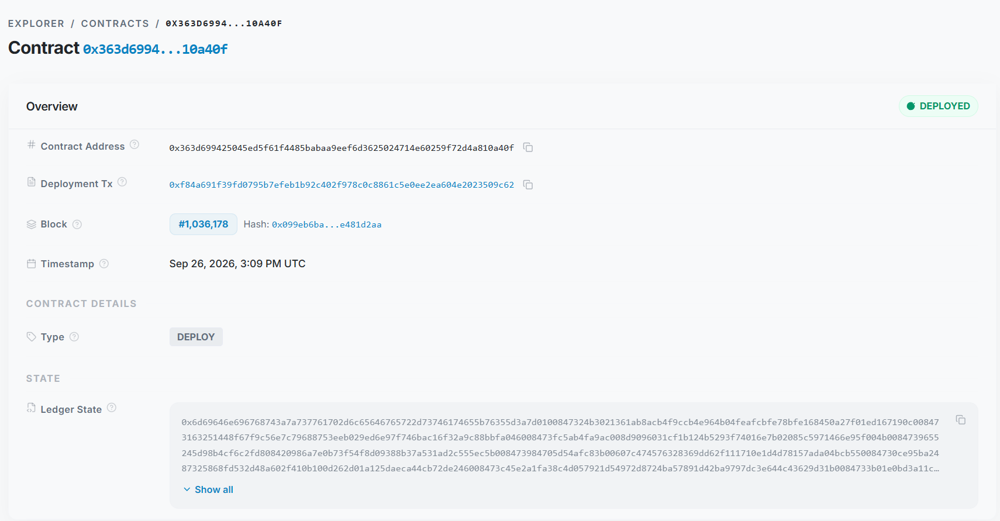
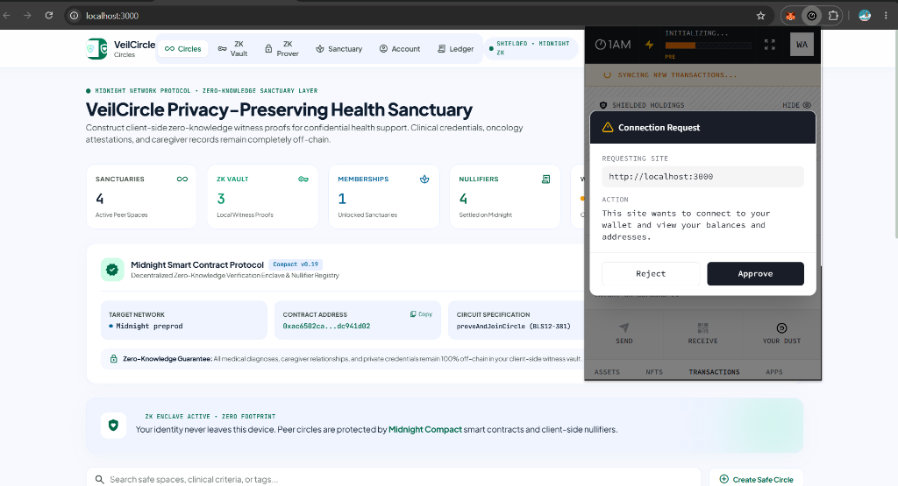
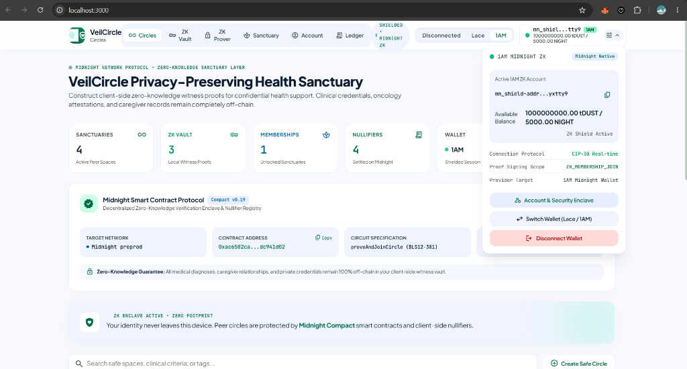
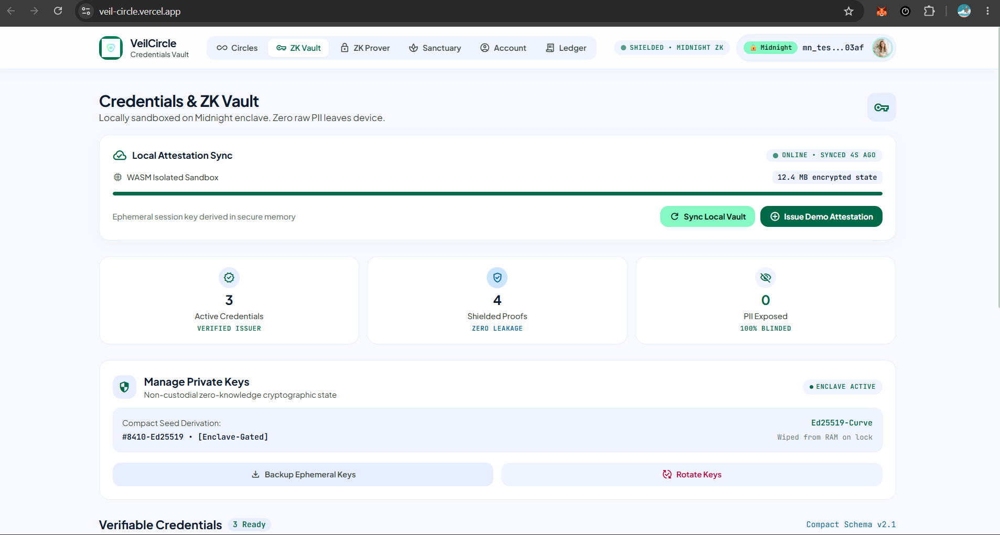
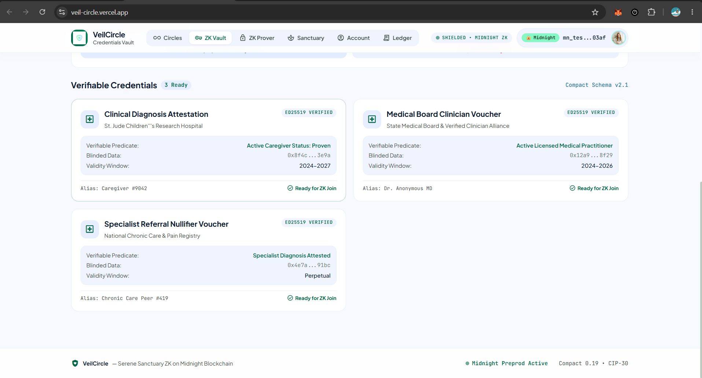
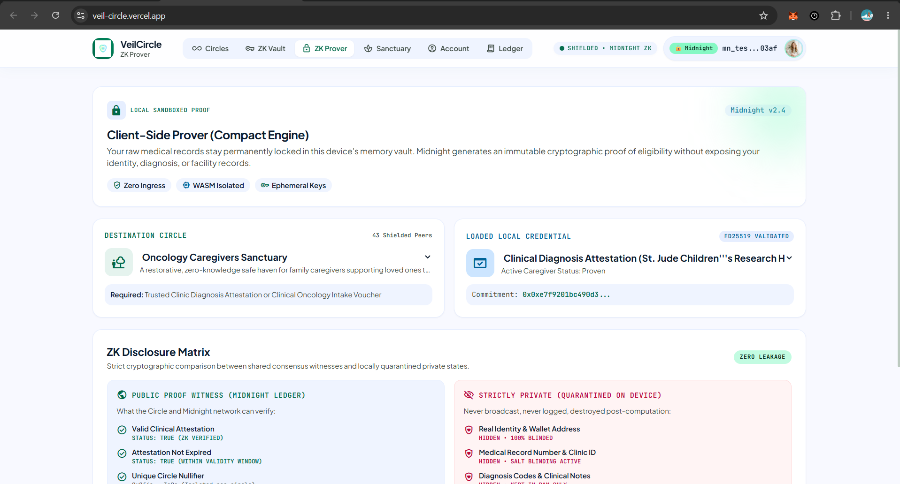
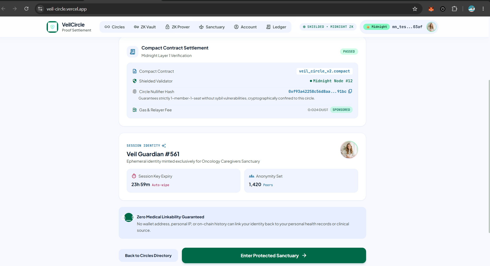
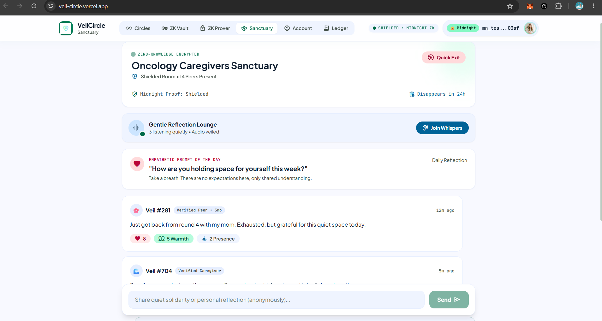
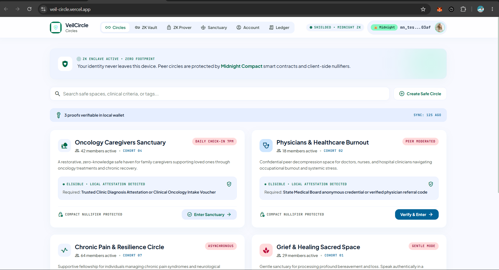
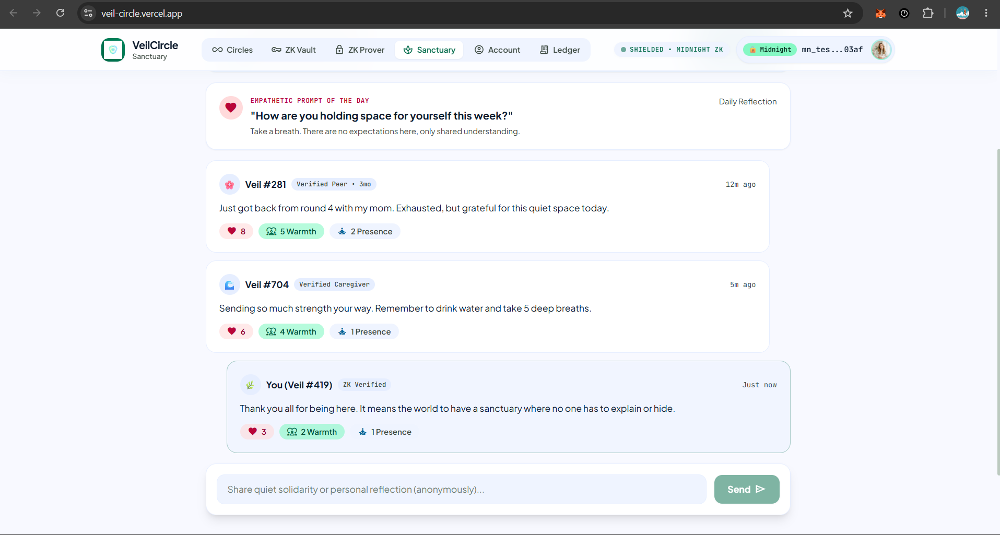

# VeilCircle 🛡️ — Anonymous & Zero-Knowledge Peer Health Support Networks

[](https://veil-circle.vercel.app/)
[](https://midnight.network)
[](https://docs.midnight.network)
[](https://github.com/shritesh263/-VeilCircle-/actions)
[](LICENSE)
[](https://x.com/veilcircle?s=11)

> **"Prove you belong in a support group — without ever revealing who you are."**

---

## 🔗 Official Submission Links

| Resource | Link / Handle | Status |
| :--- | :--- | :--- |
| 🚀 **Live Production DApp** | [https://veil-circle.vercel.app/](https://veil-circle.vercel.app/) | 🟢 **Live & Active** |
| 🛡️ **Midnight Preview Contract** | [`363d699425045ed5f61f4485babaa9eef6d3625024714e60259f72d4a810a40f`](https://preview.midnightexplorer.com/contract/363d699425045ed5f61f4485babaa9eef6d3625024714e60259f72d4a810a40f) | 🟢 **Confirmed On-Chain** |
| 🔍 **Explorer Verification** | [preview.midnightexplorer.com/contract/...](https://preview.midnightexplorer.com/contract/363d699425045ed5f61f4485babaa9eef6d3625024714e60259f72d4a810a40f) | 🟢 **Verified** |
| 🐦 **Twitter / X Account** | [https://x.com/veilcircle?s=11](https://x.com/veilcircle?s=11) (`@veilcircle`) | 🟢 **Active** |
| 🎥 **Product Demo Video** | [Watch Demo Video](https://drive.google.com/file/d/1E6O49P6oLA8SkSfrYYYnxGW4Ms178uU9/view?usp=sharing) | 🟢 **Available** |

---

## 🌐 Live On-Chain Deployment Details (Midnight Preview)

> [!IMPORTANT]
> ### 🚀 PROVEN ON-CHAIN: Live Midnight Preview Smart Contract
> 
> ```text
> 📍 Contract Address : 363d699425045ed5f61f4485babaa9eef6d3625024714e60259f72d4a810a40f
> 🆔 Deployment TxHash: f84a691f39fd0795b7efeb1b92c402f978c0c8861c5e0ee2ea604e2023509c62
> 👤 Deployer Address : mn_addr_preview1g46qj0948v5skhp9naufza0wmggredhp8reu30efhq69yevd86wsx4yg6e
> 🌐 Target Network   : Midnight Preview Testnet
> 📜 Language & Engine: Compact 0.30.0 (Pragma >= 0.22.0) • @midnight-ntwrk/compact-runtime@0.15.0
> 🔍 Explorer Link    : https://preview.midnightexplorer.com/contract/363d699425045ed5f61f4485babaa9eef6d3625024714e60259f72d4a810a40f
> 📁 Local Record     : contract/deployments/preview.json • .midnight-contract.json
> ```

---

## 📁 Repository Structure

This repository follows the official Midnight Moonshot standard file structure:

```text
VeilCircle/
├── contract/                       # Compact smart contract & ZK circuits
│   ├── src/
│   │   ├── veilcircle.compact      # Main Compact smart contract & ZK circuits
│   │   ├── contract.ts             # Contract runtime bindings & schema
│   │   ├── crypto.ts               # Cryptographic primitives & witness generators
│   │   └── managed/                # Auto-generated Compact compiler artifacts (keys, zkir)
│   ├── scripts/                    # Deployment & wallet helper scripts
│   ├── test/                       # Contract & circuit Vitest test suite
│   ├── deployments/                # On-chain deployment records (Preview & Preprod)
│   ├── compile.sh                  # Compact compilation build script
│   ├── package.json                # Contract dependencies & scripts
│   └── tsconfig.json               # Contract TypeScript configuration
├── frontend/                       # Web3 DApp user interface (React + Vite + Tailwind)
│   ├── public/                     # Static assets & public ZK prover keys
│   ├── src/
│   │   ├── components/             # UI components (PrivacySanctuary, WalletConnect, etc.)
│   │   ├── hooks/                  # Custom hooks (useMidnight, etc.)
│   │   ├── services/               # Midnight client & crypto services
│   │   ├── wallet/                 # 1AM & Lace wallet connector adapters
│   │   ├── utils/                  # Contract interaction & formatting helpers
│   │   ├── App.tsx                 # Main application entry component
│   │   └── main.tsx                # React DOM bootstrap
│   ├── package.json                # Frontend dependencies & scripts
│   └── vite.config.ts              # Vite bundler configuration
├── docs/                           # Documentation & visual assets
│   ├── screenshots/                # Application UI, wallet sync & deployment proofs
│   └── USAGE.md                    # Detailed user walkthrough & guide
├── .github/
│   └── workflows/
│       └── ci.yml                  # GitHub Actions CI/CD test & build pipeline
├── README.md                       # Comprehensive overview, architecture, & links
├── PROPOSAL.md                     # Complete Level 3 project proposal
└── package.json                    # Workspace scripts & orchestration
```

---

## 💡 The Problem & The Zero-Knowledge Solution

### The Paradox of Sensitive Peer Support
Peer support groups for sensitive medical diagnoses, mental health journeys, trauma recovery, oncology, and whistleblower communities face an impossible dilemma:
- **Stay Open & Unverified**: Bad actors, trolls, employers, and insurance adjusters infiltrate safe spaces, destroying participant psychological safety.
- **Enforce Identity Verification**: Requiring participants to share clinical intake records, government IDs, or medical paperwork exposes the exact diagnosis and personal identity they desperately need to protect.

### The VeilCircle Solution
**VeilCircle** solves this paradox by combining **Midnight blockchain** zero-knowledge smart contracts with **client-side ZK-SNARK proving**. 

Users prove mathematical possession of a legitimate clinical attestation or recovery referral without disclosing their identity, diagnosis, medical provider, or cross-circle activity.

```text
+-------------------------------------------------------------------------------------------------+
|                                 CLIENT ENCLAVE (BROWSER ONLY)                                   |
|                                                                                                 |
|   [ Private Patient Credential ]               [ Private Witness Parameters ]                   |
|   • Diagnosis / Condition Attestation          • secretKey: sk (256-bit entropy)                |
|   • Clinician / Institution Signature          • blindingSalt: r (256-bit entropy)              |
|                                                                                                 |
|                                         │                                                       |
|                                         ▼                                                       |
|                       [ Client-Side Compact ZK-Prover Engine ]                                  |
|                       • Calculates: C = Hash(sk, attribute, r)                                  |
|                       • Calculates: Nullifier = Hash(sk, circleId)                              |
|                       • Generates ZK-SNARK Proof (π)                                            |
+-----------------------------------------┬-------------------------------------------------------+
                                          │ (Transmits ONLY Proof π, Nullifier, & Circle ID)
                                          │  ZERO IDENTITY OR MEDICAL ATTRIBUTES LEAVE DEVICE
                                          ▼
+-------------------------------------------------------------------------------------------------+
|                             MIDNIGHT BLOCKCHAIN & SMART CONTRACT                                |
|                                                                                                 |
|   [ Compact 0.30.0 Smart Contract: veilcircle.compact ]                                         |
|   1. Verifies proof π against registered eligibility commitments: C ∈ ValidCommitments          |
|   2. Enforces non-membership in spent registry: Nullifier ∉ SpentNullifiers                     |
|   3. Atomically registers Nullifier to prevent double-joining                                   |
|   4. Grants anonymous admission token to peer sanctuary                                         |
+-------------------------------------------------------------------------------------------------+
```

---

## 🔬 Deployed Compact Zero-Knowledge Circuits

All 4 circuits from [`contract/src/veilcircle.compact`](contract/src/veilcircle.compact) are deployed and active on Midnight Preview:

| Circuit Name | Purpose & Cryptographic Function | Access |
| :--- | :--- | :--- |
| `createCircle` | Instantiates new confidential peer support networks with eligibility rules | Public |
| `registerCredentialCommitment` | Registers clinical provider commitment hashes ($C = \text{Hash}(sk, \text{attr}, r)$) | Public / Provider |
| `proveAndJoinCircle` | Proves possession of authorized witness parameters, checks nullifiers, and joins circle | ZK-SNARK Proof |
| `isNullifierSpent` | Queries whether a member's nullifier has already joined the group | Public View Query |

---

## 📸 Application & On-Chain Visual Gallery

| 1. Midnight Preview Smart Contract Deployment | 2. 1AM / Lace Wallet Connection |
| :---: | :---: |
|  |  |

| 3. Connected Dashboard & Balance Sync | 4. Explore Health Support Circles |
| :---: | :---: |
|  |  |

| 5. Client-Side ZK Private Credentials Vault | 6. Create Support Circle Modal |
| :---: | :---: |
|  |  |

| 7. Client-Side ZK Prover & Witness Blinding | 8. Proof Settlement & Admission Token |
| :---: | :---: |
|  |  |

| 9. Anonymous Peer Sanctuary (Live Encrypted Room) | 10. On-Chain Ledger & Nullifier Registry |
| :---: | :---: |
|  |  |

---

## ⚡ Quick Start & Local Execution

### 1. Install Dependencies
```bash
npm run install:all
```

### 2. Run Contract Tests
```bash
npm run test:contract
```

### 3. Run Frontend Tests
```bash
npm run test:frontend
```

### 4. Start Development Server
```bash
npm run dev
```
Open [http://localhost:5173](http://localhost:5173) in your browser.

---

## 👛 Supported Midnight Wallets

VeilCircle supports both official Midnight browser extension adapters:
1. **1AM Wallet**: Full support for Preview testnet, unshielded balance sync, and transaction signing.
2. **Lace Wallet**: Native support for Midnight Preview DApp Connector API.

---

## 📜 License

Licensed under the [Apache License, Version 2.0](LICENSE).
